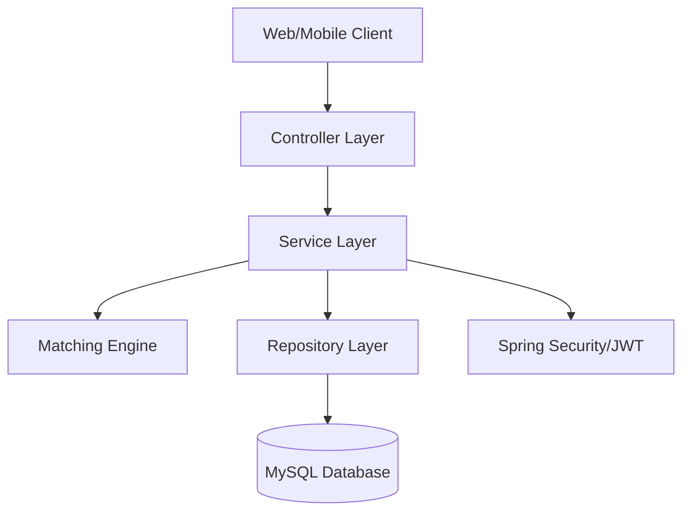
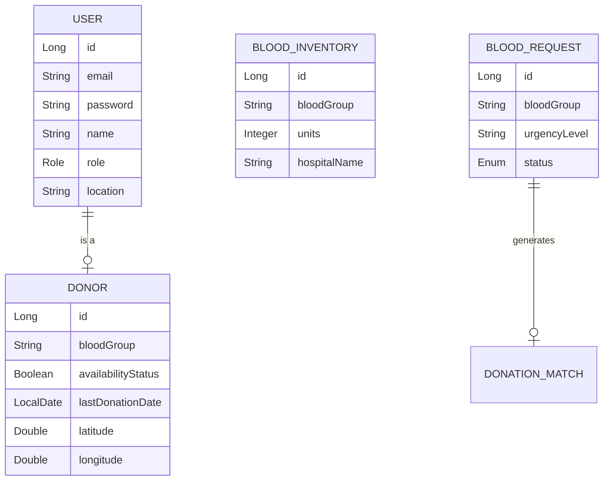

# System Design & Architecture

This document outlines the architectural decisions and data models used in the Blood Bank Matching System.

## Architecture Diagram

The system follows a classic **Layered Architecture**:

## Data Model (ER Diagram)

The relationships between core entities are defined below:

## Core Logic: Donor Matching Engine

The matching engine specifically follows these steps to ensure safety and efficiency:

1. **Blood Group Matching**: Filters the `Donor` table for exact matches to the requested blood group.
2. **Availability Check**: Only selects donors where `availabilityStatus = true`.
3. **Safety Window**: Calculates `LocalDate.now().minusMonths(3)`. Only donors who haven't donated within this window are considered.
4. **Proximity Search**: 
   - Uses a simulated distance formula (Euclidean or Haversine) based on `latitude` and `longitude`.
   - Sorts donors from nearest to farthest.
5. **Selection**: Picks the top $N$ (default 5) donors and creates a `DonationMatch` entry for each, triggering a mock notification.

## Security Flow

1. **User Signup**: Password is encrypted using `BCryptPasswordEncoder`.
2. **Login**: User provides credentials -> `AuthenticationManager` verifies.
3. **Token Issuance**: A JWT signed with a secret key is returned to the client.
4. **Interception**: `JwtAuthenticationFilter` intercepts every request, extracts the token, and sets the `SecurityContext`.
5. **Access Control**: Methods are protected using `@PreAuthorize` or standard `HttpSecurity` rules based on roles (ADMIN, DONOR, RECEIVER).
